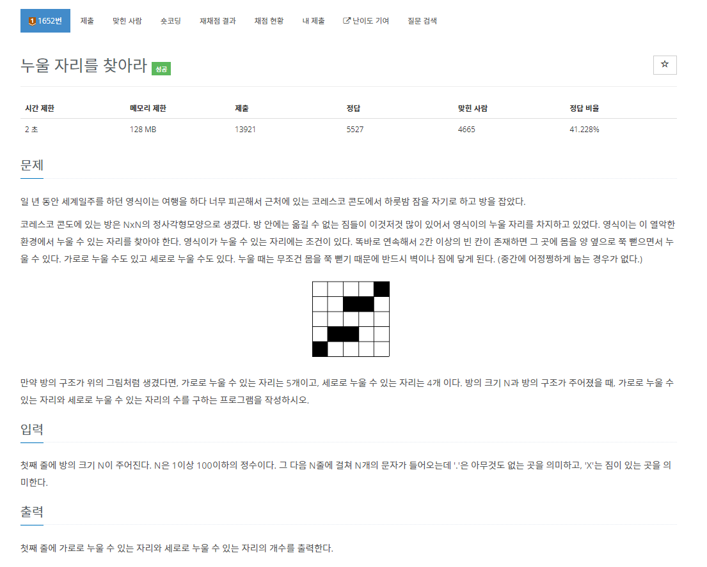
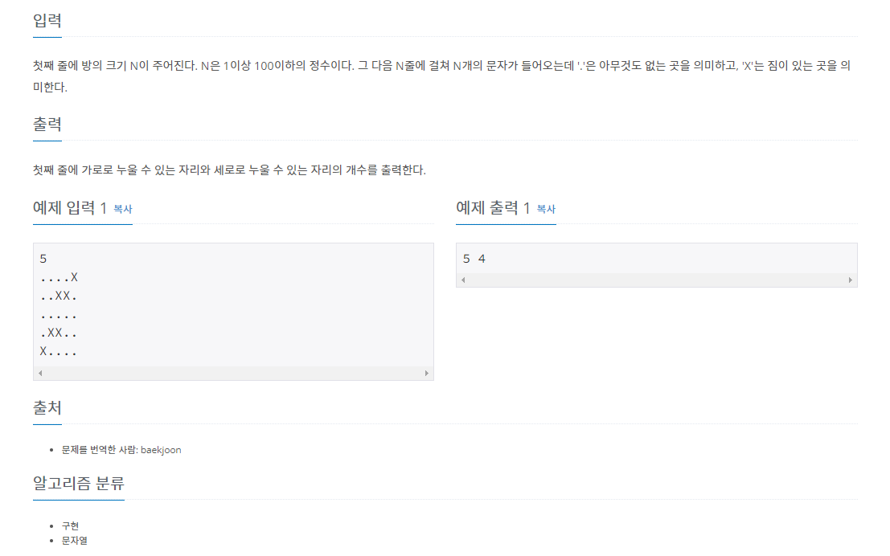

# 백준 1652번 누울 자리를 찾아라




이 문제는 가로줄에 2칸 이상의 자리가 몇개가 있는지 세로줄에 2칸 이상의 자리가 몇개가 있는지 판단하는 문제이다.

알고리즘을 구성할 때 주의할 점은 가로줄과 세로줄 하나에 2칸 이상의 자리가 여러개가 있을 수 있다는 점이다. 이에 유의하며 알고리즘을 구성하면 된다.

세로줄 함수와 가로줄 함수를 따로 만들었으며 함수 내부에서는 while 반복문을 사용하여 무한루프를 걸고, 만약에 i 값이 입력받는 N값과 같아지면 count 값을 리턴하며 이 무한루프를 탈출하도록 했다.

코드는 다음과 같다.

```python

# 입력 받기
N = int(input())

arr = [' ' for i in range(N)]
for i in range(N):
    arr[i] = input()

# 가로줄 함수
def row(x, n):
    i = 0
    count = 0 # 자리의 개수
    cnt = 0 # 칸 수
    while True:
        if i == N:
            return count
        # 빈자리가 있을 경우 벽을 만날때 까지 i 값과 cnt 값을 1씩 증가, 만약 N 끝까지 도달했을경우 break
        if x[n][i] == '.':
            while x[n][i] != 'X':
                cnt += 1
                i += 1
                if i == N:
                    break
            # 칸이 2칸 이상일 경우 자리 1개 추가
            if cnt >= 2:
                count += 1
        # 벽을 만날 경우 i 값을 증가하고, 칸 수는 0으로 초기화
        else:
            i += 1
            cnt = 0
# 세로줄 함수
def col(x, n):
    i = 0
    count = 0 # 자리의 개수
    cnt = 0 # 칸 수
    while True:
        if i == N:
            return count
        # 빈자리가 있을 경우 벽을 만날때 까지 i 값과 cnt 값을 1씩 증가, 만약 N 끝까지 도달했을경우 break
        if x[i][n] == '.':
            while x[i][n] != 'X':
                cnt += 1
                i += 1
                if i == N:
                    break
            # 칸이 2칸 이상일 경우 자리 1개 추가
            if cnt >= 2:
                count += 1
        # 벽을 만날 경우 i 값을 증가하고, 칸 수는 0으로 초기화
        else:
            i += 1
            cnt = 0
ans_row = 0
ans_col = 0
# N 개의 가로줄 세로줄 마다 반복
for i in range(N):
    ans_row += row(arr, i)
    ans_col += col(arr, i)
    
# 답을 출력
print(ans_row, ans_col)
```