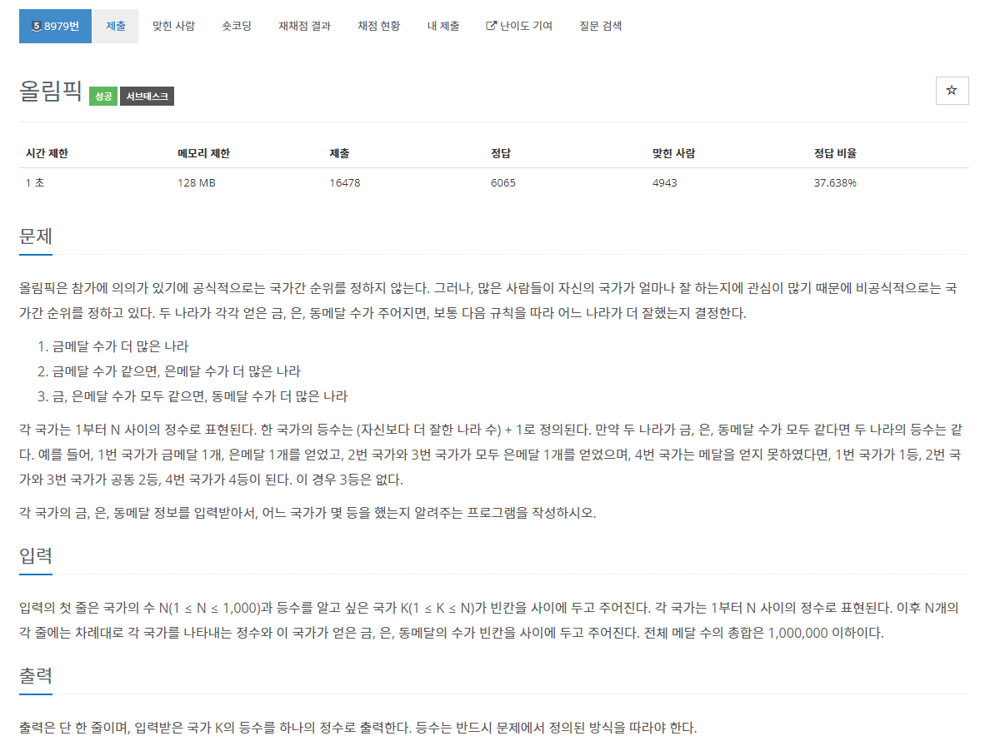
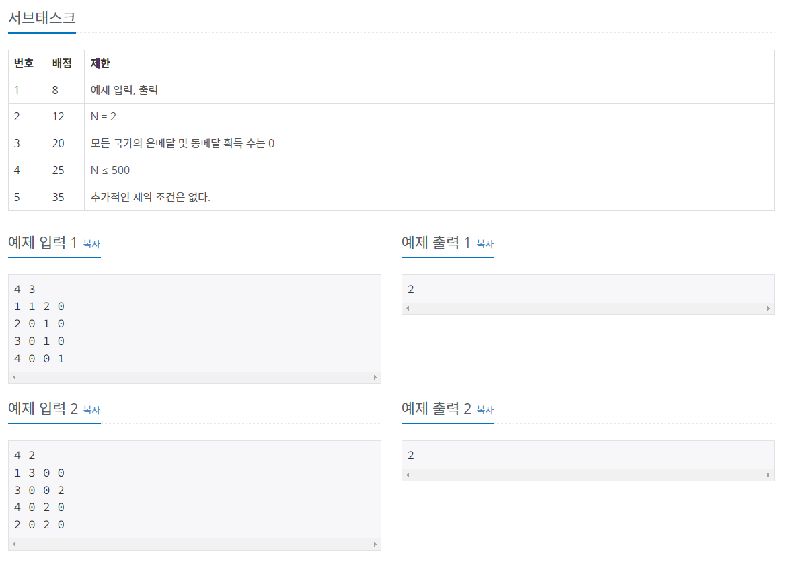

# 백준 8979번 올림픽




이 문제 같은 경우는 문제의 조건식에 유의하여 알고리즘을 구성하면 된다.

1. 금메달 수가 더 많은 나라
2. 금메달 수가 같으면, 은메달 수가 더 많은 나라
3. 금, 은메달 수가 모두 같으면, 동메달 수가 더 많은나라.

기본적으로 이 구현 문제는 위 조건에 따라 정렬을 해주어야 하고, 이는 Python에서 sort 부분의 key 속성을 활용하여 위 조건을 적용하면 된다. 

이때 람다식을 활용하여 key에 적용하며 람다식은 다음과 같이 쓴다.

`lamda x : (x[1], x[2], x[3])`

이에 따라 정렬하는 코드는 다음과 같다.

```python
# 내림차순으로 정렬하기 때문에 reverse 값은 True로 설정한다.
arr.sort(key=lamda x : (x[1], x[2], x[3]), reverse=True)
```

또한, 공동 등수를 처리해주어야 하고, 다음 등수는 공동 등수가 없었을 경우의 등수로 처리해주어야 하기 때문에 알고리즘을 구성하기 어려웠다.

이는 이미 정렬된 리스트로 부터 k 값에 해당되는 인덱스 값을 출력하는 것이 아닌 place 라는 리스트와 a 라는 변수를 설정하여 공동 등수가 존재할 경우 a 값에 인덱스 값을 대입하지 않고 place 에 넣는 방식으로 알고리즘을 구성했다.

코드는 다음과 같다.

```Python
n, k = map(int, input().split())
# 국가 금메달수 은메달수 동메달수
arr = [[0, 0 ,0, 0] for _ in range(n)]
for i in range(n):

    arr[i] = list(map(int, input().split()))

# 문제의 조건에 따라 금메달, 은메달, 동메달을 기준으로 내림차순 정렬
arr.sort(key=lambda x: (x[1], x[2], x[3]), reverse=True)

# 리스트와 변수 값을 미리 1로 설정하고 인덱스 1 부터 n - 1 까지 공동 등수가 존재함과 아닌 경우를 달리하여 리스트에 a 를 넣는다.
place = [1]
a = 1
for i in range(1, n):
    if arr[i][1] == arr[i-1][1] and arr[i][2] == arr[i-1][2] and arr[i][3] == arr[i-1][3]:
        place.append(a)
    else:
        a = i + 1
        place.append(a)

# k에 해당되는 인덱스 i 를 찾고 해당되는 인덱스 i 의 리스트를 출력
for i in range(n):
    if arr[i][0] == k:
        print(place[i])

```