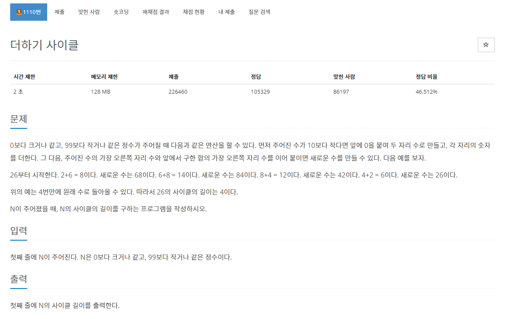
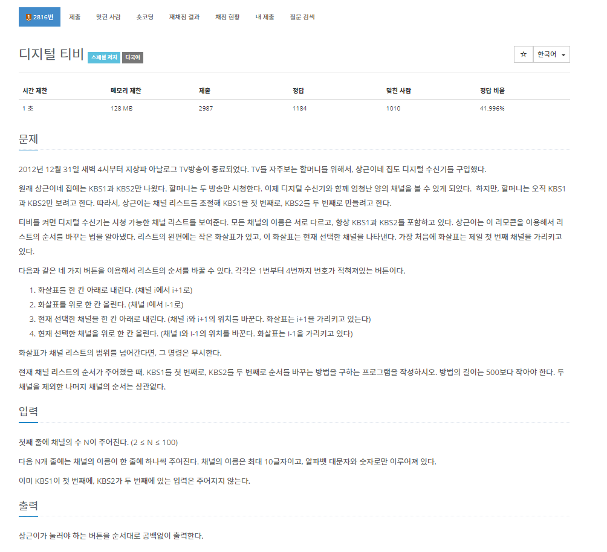
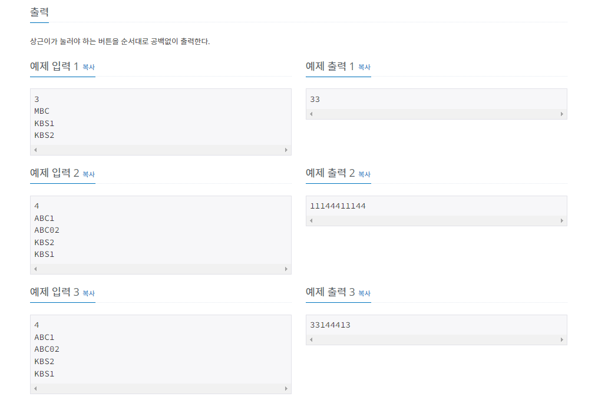

# 구현 

1. 구현이란?
    - 머릿속에 있는 알고리즘을 소스코드로 바꾸는 과정
    - 사소한 조건 설정이 많은 문제일수록 코드로 구현하기 어려움.

- 구현 문제를 풀기 위해서는 프로그래밍 문법을 완전히 숙지해야 함.

2. 주의점
    - 메모리 제약사항
        - 보통 파이썬에서 리스트같은 배열을 사용할 때 주의할 점으로, 1000만 이상의 리스트가 선언된다면 메모리 용량 제한으로 풀 수 없게 된다.
    - 시간제한
        - 보통 파이썬은 C 나 C++ 에 비하면 느리므로 큰 수 연산이 아닐 때는 C 나 C++을 사용하는 것을 추천하며 파이썬으로 제출해야 할 경우 제출한 코드가 1초에 2000만 번의 연산을 수행한다는 것을 염두해야 한다.
        - 코딩 테스트 환경이 Pypy3 를 지원하는 경우 Pypy3 가 Python3 문법을 지원하면서 실행속도가 더 빠르기 때문에 Pypy3를 사용하는 것이 좋다.

3. 예제

    
    
    ``` python
    n = int(input())
    num = n
    count = 0
    while True:
        a = num // 10 + num % 10

        num = (num % 10) * 10 + a % 10
        count += 1
        if num == n:
            print(count)
            break
    ```
    - 간단한 구현 문제 이므로 설명은 생략한다.

    <br>

    
    

    - 예제 입력 1과 예제 입력 2를 참고하며 알고리즘을 구현했으며, 1번부터 4번까지는 코드가 길어지는 것을 염두하여 함수로 만들었다.
    - 출력은 buttonclick 리스트를 만들어 각 함수를 호출할때마다 buttonclick 리스트에 해당되는 번호를 추가하는 방식으로 구현했다.
    
    <br>


    ``` python
        
    n = int(input())

    arr = [0 for _ in range(n)]

    for i in range(n):
        arr[i] = input()

    buttonclick = []
    index = 0
    def arrow_down():
        global index
        index += 1
        buttonclick.append(1)

    def arrow_up():
        global index
        index -= 1
        buttonclick.append(2)

    def channel_down(arr, idx):
        global index
        temp = arr[idx]
        arr[idx] = arr[idx+1]
        arr[idx + 1] = temp
        index += 1
        buttonclick.append(3)

    def channel_up(arr, idx):
        global index
        temp = arr[idx]
        arr[idx] = arr[idx-1]
        arr[idx - 1] = temp
        index -= 1
        buttonclick.append(4)
        
    if arr[1] == "KBS1":
        channel_down(arr, index)
    else:
        while arr[index] != "KBS1":
            arrow_down()
        
        while arr[0] != "KBS1":
            channel_up(arr, index)

        arrow_down()
    if arr[2] == "KBS2":
        channel_down(arr, index)
    else:
        while arr[index] != "KBS2":
            arrow_down()

        while arr[1] != "KBS2":
            channel_up(arr, index)

    for i in range(len(buttonclick)):
        print(buttonclick[i], end='')
    ```