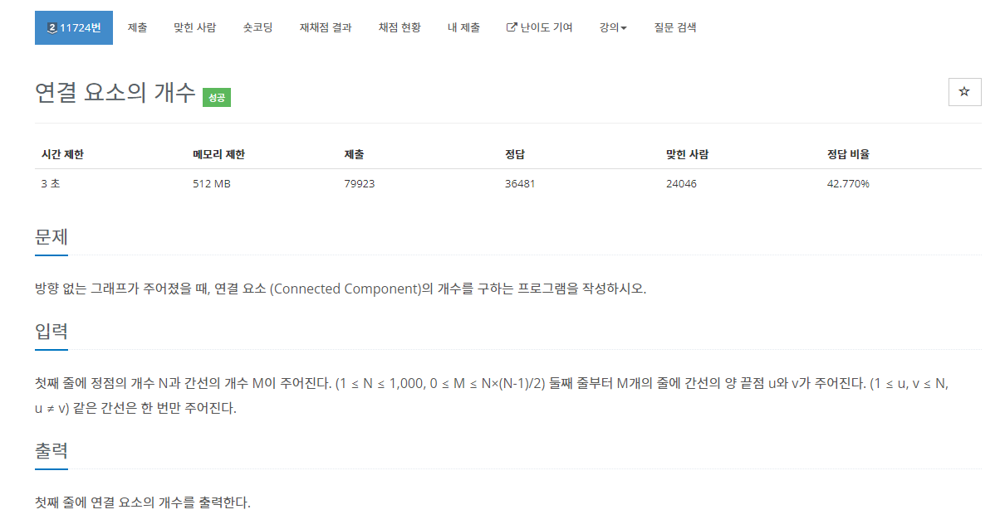
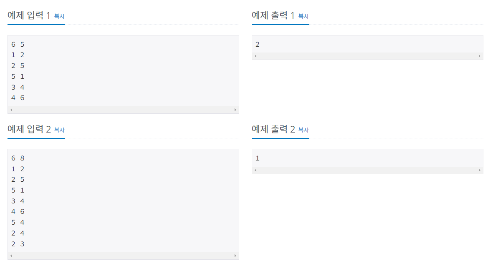
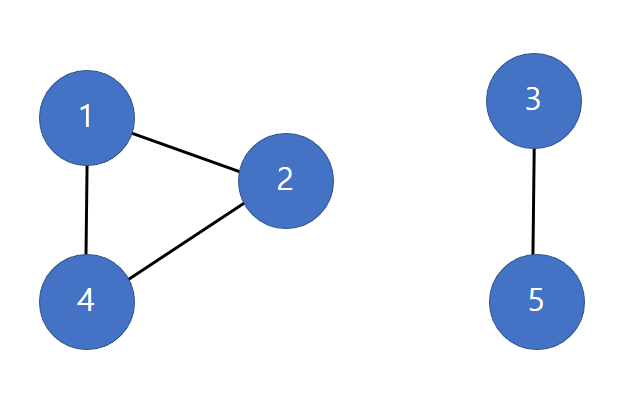

# 백준 11724번 연결 요소의 개수




이 문제는 방향 없는 그래프가 주어지고, 주어진 그래프에서 연결 요소가 얼마나 있는지 판단하는 알고리즘을 작성하는 문제이다.

일단 이 문제를 풀기 위해서는 연결요소가 무엇인지 알아야 한다.

## 연결요소란?

- 원 그래프가 주어졌을 때 독립적으로 구성된 부분 그래프를 요소라고 한다.

- 독립적으로 구성되어있다는 것은 노드와 엣지가 서로 겹치지 않는 것(이어지지 않음)을 뜻하며, 이때 요소 가운데 모든 노드 쌍에 대해 경로가 존재하는 부분 그래프를 연결 요소라고 한다.



- 위 사진 같은 경우, 이 사진에 나와 있는 그래프 전부를 원 그래프라고 하며, 1, 2, 4 노드 끼리 연결되어 있는 그래프가 하나의 부분 그래프이자 연결요소이고, 3, 5 노드 끼리 연결되어 있는 그래프가 또 다른 부분 그래프이자 연결요소이다.

- 이 그래프는 연결 요소가 2개가 있다고 볼 수 있다.

이 문제는 그래프 탐색을 위한 기본 알고리즘으로 깊이 우선 탐색이나 너비 우선 탐색을 사용해야 하며, 주어진 문제는 난잡하게 이어진 그래프이기 때문에 깊이 우선 탐색이 아닌 너비 우선 탐색을 사용해 문제를 풀었다.

너비 우선 탐색 이하 bfs 가 시행되었을 경우 주어진 그래프내 모든 노드들을 방문하게 된다. 만약 bfs 가 시행되었음에도 불구하고 방문되지 않는 노드가 존재할 경우 이는 또 다른 그래프라고 볼 수 있다.

코드 작성은 다음 과 같다.
```python

# 입력을 sys.stdin.readline() 으로 받지 않고 input() 으로 받을 경우 시간 초과로 인해 문제가 정답처리 되지 않음. input() 으로 할 경우에는 Pypy3 로 해야 정답처리가 됨.

import sys

# 너비 우선 탐색 알고리즘
def bfs(graph, source):
    que = []
    # 큐 리스트에 해당되는 source 노드 추가
    que.append(source)
    # source 노드에 방문했을 경우 True 값 대입
    visited[source] = True

    # 큐 리스트가 비어있을 경우 bfs 종료, 반복문 루프가 하나씩 증가할 경우 깊이가 1씩 증가
    while(len(que) != 0):
        current = que[0]
        que.remove(current)

        # 해당 current 노드와 연결되어 있는 하위 노드들을 que 리스트에 추가, 만약 방문한 적이 있으면 하위 노드가 아님.
        for i in range(len(graph[current])):
            next = graph[current][i]

            if(not visited[next]):
                que.append(next)
                visited[next] = True


n, m = map(int, sys.stdin.readline().split())
visited = [False for _ in range(n + 1)]
# 엣지의 집합 E 는 이중 리스트를 통해 구현
graph = [[] for _ in range(n + 1)]
count = 0
for i in range(m):
    u, v = map(int, sys.stdin.readline().split())
    graph[u].append(v)
    graph[v].append(u)


for i in range(1, n+1):
    # 방문한 적이 있을 경우 continue, 독립된 그래프가 아님
    if visited[i]:
        continue
    else:
        # bfs 가 시행되면 하나의 그래프 모양이 형성이 됨. 즉, 연결 요소의 개수가 1씩 증가함.
        bfs(graph, i)
        count += 1

# 연결 요소 개수 출력
print(count)
```