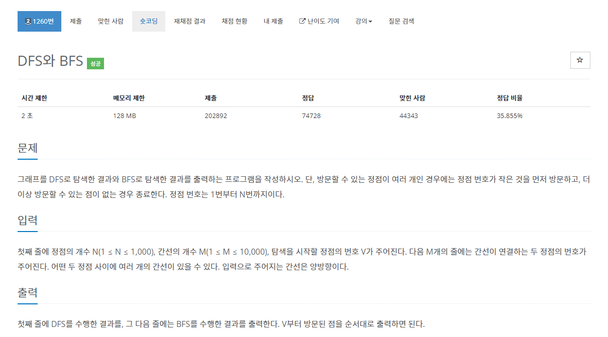
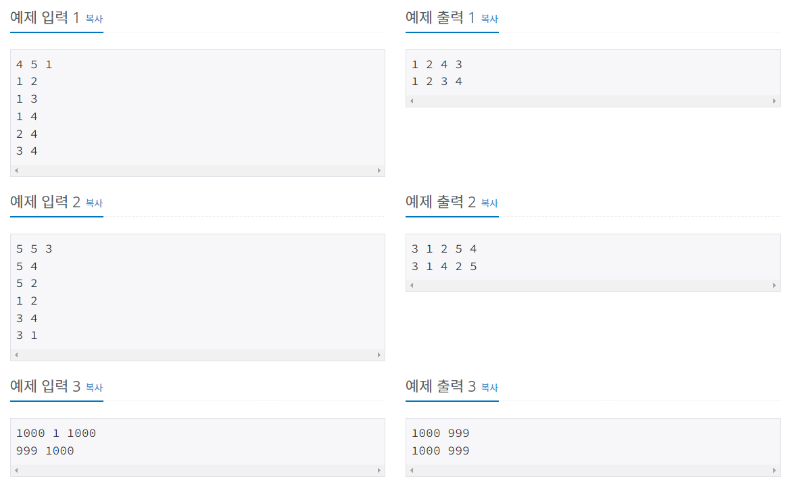
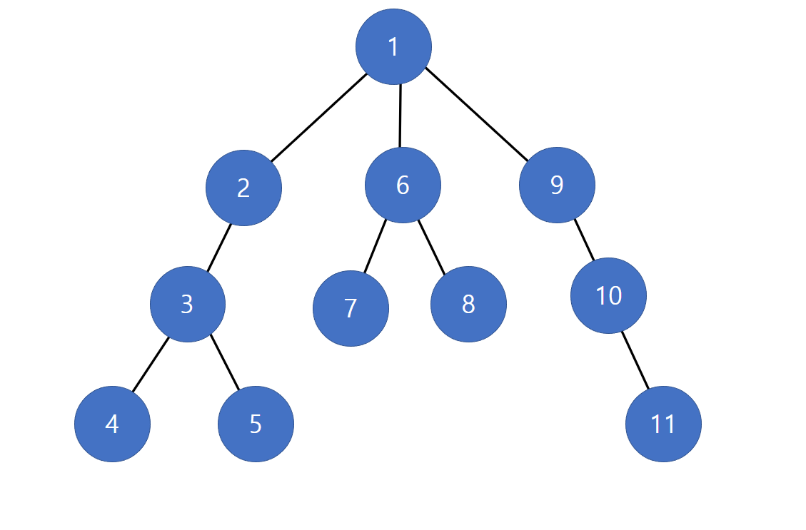
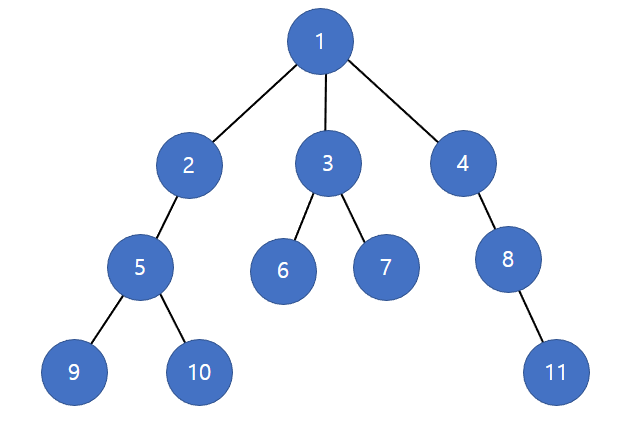
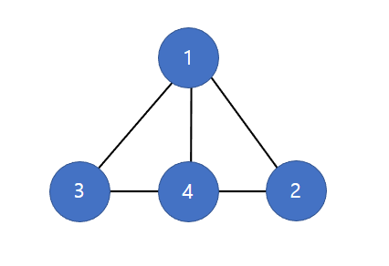
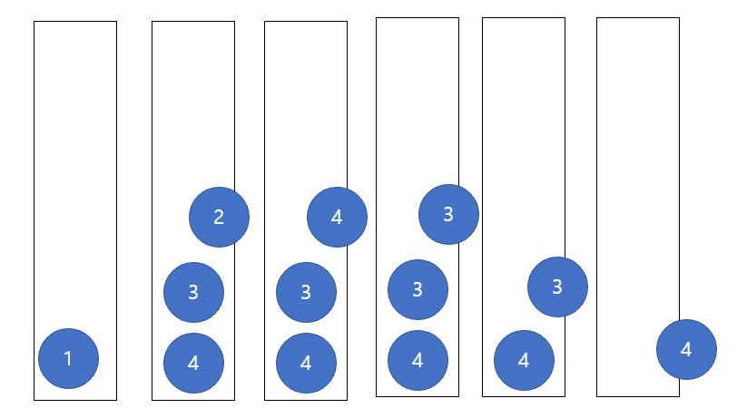
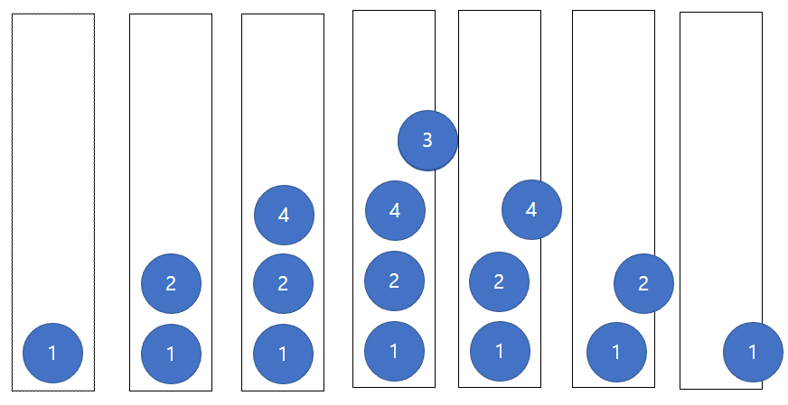

# 백준 1260번 DFS 와 BFS




이 문제는 그래프를 dfs 로 탐색한 결과와 bfs로 탐색한 결과를 출력하는 프로그램을 작성하는 문제이다.

이때 조건으로는 정점번호가 작은 것부터 먼저 방문하는 것이 조건이다.

기본적으로 그래프를 입력하기 위한 변수 선언문은 다음과 같다.

```python
n, m, v = map(int, sys.stdin.readline().split())
graph = [[] for _ in range(n + 1)]

for i in range(m):
    a, b = map(int, sys.stdin.readline().split())
    graph[a].append(b)
    graph[b].append(a)
```

그리고 정점번호가 작은 것부터 먼저 방문하는 조건을 만족시키기 위해서는 그래프를 정렬해주어야 한다.

```python
for i in range(n + 1):
    graph[i].sort()
```

해당 문제를 풀기 위해서는 dfs 와 bfs 에 대한 이해가 필요하다.

## dfs 란?
- 깊이 우선 탐색을 뜻하며, 그래프에서 깊은 부분을 우선적으로 탐색하는 알고리즘이다.

- 구현 방법으로는 스택 자료구조를 사용하여 알고리즘을 구성한다.

    1. 탐색 시작 노드를 스택에 삽입하고 방문처리를 한다.
    2. 해당 노드에 방문하지 않은 인접 노드가 있다면 그 중 하나를 선택하여 스택에 삽입하고, 방문처리를 한다. 방문하지 않은 인접 노드가 없다면 스택에서 최상단 노드를 꺼낸다(백트래킹)
    3. 2번 과정을 더 이상 수행할 수 없을 때까지 반복한다.



수행 결과 다음과 같은 번호 순서대로 탐색을 진행하게 된다.

깊이 우선 탐색은 다음과 같은 특징을 지닌다.

1. 시작 노드에서 시작해서 깊이를 우선으로 탐색하다가 더 이상 없을 경우 되돌아가며 탐색한다.
2. 재귀적으로 동작한다.
3. 어떤 노드를 방문했었는지 여부를 반드시 검사한다.
4. 스택 자료구조를 사용하며 선입후출을 원칙으로 탐색한다.

## bfs 란?

- 너비 우선 탐색을 뜻하며, 그래프에서 시작 정점으로부터 가까운 정점을 우선적으로 탐색하는 알고리즘이다.

- 구현 방법으로는 큐 자료구조를 사용하여 알고리즘을 구성한다.

    1. 탐색 시작 노드를 큐에 삽입하고 방문처리를 한다.
    2. 큐에서 꺼낸 노드와 인접한 노드들 중 방문하지 않은 노드들을 모두 차례로 방문하고 큐에 삽입한다.
    3. 큐가 소진될 때까지 계속한다.



수행 결과 다음과 같은 번호 순서대로 탐색을 진행하게 된다.

너비 우선 탐색은 다음과 같은 특징을 지닌다.

1. 시작 노드에서 시작해서 거리에 따라 단계별로 탐색한다.
2. 재귀적으로 동작하지 않는다.
3. 어떤 노드를 방문 했었는지 여부를 반드시 검사해야 한다.
4. 큐 자료구조를 사용하여 선입선출을 원칙으로 탐색한다.

문제를 풀기 위해서는 이제 직관적으로 이해를 하기 위해 그래프를 그려볼 필요가 있다.



첫 번째 예시는 다음과 같은 형태를 지니며 이를 바탕으로 알고리즘을 구성하여 코드를 작성하면 다음과 같다.

```python
import sys
import copy

# 큐 중복 문제가 없음.
def bfs(graph, source):
    que = []
    que.append(source)
    visited_bfs[source] = True

    while(len(que) != 0):
        current = que[0]
        que.pop(0)
        print(current, end= ' ')

        for i in range(len(graph[current])):
            next = graph[current][i]
            
            if not visited_bfs[next]:
                que.append(next)
                visited_bfs[next] = True

# 재귀
def dfs(graph, source):
    visited_dfs[source] = True
    print(source, end= ' ')
    
    for i in range(len(graph[source])):
        next = graph[source][i]
        if not visited_dfs[next]:
            visited_dfs[next] = True
            dfs(graph, next)

# 스택 중복이 일어남.
def dfs_stack(graph, source):
    stack.append(source)
    
    while(len(stack) != 0):
        current = stack[len(stack) - 1]
        stack.pop()
        
        if not visited_dfs_stack[current]:
            visited_dfs_stack[current] = True
            print(current, end=' ')
            for i in range(len(graph[current])):
                next = graph[current][i]

                if not visited_dfs_stack[next]:
                    stack.append(next)

# 스택 중복이 없음
def dfs_stack(graph, source):
    stack.append(source)
    visited_dfs_stack[source] = True
    print(source, end=' ')

    while(len(stack) != 0):
        current = stack[len(stack) - 1]
        connect = False
        for i in graph[current]:
            if not visited_dfs_stack[i]:
                connect = True
                stack.append(i)
                visited_dfs_stack[i] = True
                print(i, end=' ')
                break
        if not connect:
            stack.pop()

stack = []
n, m, v = map(int, sys.stdin.readline().split())
graph = [[] for _ in range(n + 1)]
visited_bfs = [False for _ in range(n + 1)]
visited_dfs = [False for _ in range(n + 1)]
visited_dfs_stack = [False for _ in range(n + 1)]

for i in range(m):
    a, b = map(int, sys.stdin.readline().split())
    graph[a].append(b)
    graph[b].append(a)

graph_stack = copy.deepcopy(graph)

for i in range(n + 1):
    graph[i].sort()
    graph_stack[i].sort(reverse=True)

dfs(graph, v)
print()
dfs_stack(graph_stack, v)
# 수를 
dfs_stack(graph, v)
print()
bfs(graph, v)
```

dfs 와 bfs 는 알고리즘 구조가 서로 비슷하지만 bfs 방식을 그대로 dfs 방식에 적용할 경우 여러 문제가 발생하게 된다.

만약 해당 노드에 방문했는지 판단하고, 방문하지 않았을 경우 방문처리 하는 코드가 루프내에 있을 경우 이는 dfs 가 아닌 스택을 자료구조로 사용하는 유사 bfs 가 되어버리게 된다. 따라서 깊이 탐색을 하기 위해서는 pop 을 진행하는 노드만 방문 처리를 하는 과정이 필요하다. 

그리고 break 로 탈출하는 방식으로 구현한 dfs 는 선입후출을 위해 굳이 그래프를 내림차순으로 정렬해서 적용할 필요가 없다. 이는 반복문을 통해 작은 값을 기준으로 먼저 탐색을 실행하게 되고, pop 을 하는 기준은 더 이상 연결될 노드가 없을 경우에만 pop 을 진행하기 때문이다.

```python
# 스택 중복이 일어남.
def dfs_stack(graph, source):
    stack.append(source)
    
    while(len(stack) != 0):
        current = stack[len(stack) - 1]
        stack.pop()
        
        if not visited_dfs_stack[current]:
            visited_dfs_stack[current] = True
            print(current, end=' ')
            for i in range(len(graph[current])):
                next = graph[current][i]

                if not visited_dfs_stack[next]:
                    stack.append(next)
```
해당 코드를 사용하여 저 그래프를 적용했을 때 특이한 경우의 문제가 발생하게 된다.



일반적인 방식으로 바로 pop 하는 것으로 구현한 dfs 의 스택을 그림으로 표현하면 다음과 같다.

이는 기존 bfs 나 재귀로 구현한 dfs, break로 탈출하는 방식으로 구현한 dfs 에서는 발생하지 않는데 일반적인 방식으로 바로 pop 하는 방식으로 구현한 dfs 에 저 모양의 그래프를 적용하면, 스택에 중복된 수가 넣어지는 문제가 발생한다.

문제에 적용하기 위해서 해당 노드에 방문했는데 루프에 들어가기 전에 우선적으로 판단하고, 방문하지 않았을 경우에만 출력하는 방식으로 해결할 수 있지만 정답 출력은 끝났음에도 불구하고 스택에 중복된 수가 있어서 pop을 진행하는 불필요한 과정이 포함되어 있다는 것을 알 수 있다.

따라서 break 를 사용하고, 다음 방문할 노드가 있는지 여부를 판단하여 pop 을 진행하는 방식으로 알고리즘을 개선하는 것이 좋다. 

```python
# 스택 중복이 없음
def dfs_stack(graph, source):
    stack.append(source)
    visited_dfs_stack[source] = True
    print(source, end=' ')

    while(len(stack) != 0):
        current = stack[len(stack) - 1]
        connect = False
        for i in graph[current]:
            if not visited_dfs_stack[i]:
                connect = True
                stack.append(i)
                visited_dfs_stack[i] = True
                print(i, end=' ')
                break
        if not connect:
            stack.pop()
```
break와 스택을 사용하여 하나씩 깊이 우선 탐색을 진행하고, 더이상 방문할 노드가 있는지 연결 여부를 판단하여 pop 을 진행함으로써 백트래킹이 될 수 있도록 알고리즘을 구성했다.



해당 코드를 적용했을 때 스택을 그림으로 표현하면 다음과 같다.

break 덕분에 스택에 더이상 중복된 요소가 있는 경우가 사라졌고 그 결과 더 깔끔한 알고리즘을 구성할 수 있게 되었다.

주의할 점으로는 반복문이 작은 값부터 시작하기 때문에 그래프를 내림차순으로 정렬하여 적용할 필요가 없다는 것이다.

물론 트리 구조에서는 그래프가 일정한 방향으로 쭉 뻗어 있어서 위 수정전 코드를 적용해도 중복 문제가 없겠지만 해당 문제에는 방향성이 없고 서로 연결되어 있는 형태의 그래프이기 때문에 스택 중복 문제를 해결 하기 위해서는 가급적 아래 코드를 사용하는 것이 좋다.

사실 그냥 재귀 방식으로 코드를 적용하는 것이 dfs 를 구현하기 편하다는 이점이 있다.

```python
# 재귀
def dfs(graph, source):
    visited_dfs[source] = True
    print(source, end= ' ')
    
    for i in range(len(graph[source])):
        next = graph[source][i]
        if not visited_dfs[next]:
            visited_dfs[next] = True
            dfs(graph, next)
```

bfs 의 경우에는 간단하고 이미 코드를 정리한 이력이 있어 별다른 설명 없이 해당 문제에 적용하기 위한 코드만 기술한다.

```python
# 큐 중복 문제가 없음.
def bfs(graph, source):
    que = []
    que.append(source)
    visited_bfs[source] = True

    while(len(que) != 0):
        current = que[0]
        que.pop(0)
        print(current, end= ' ')

        for i in range(len(graph[current])):
            next = graph[current][i]
            
            if not visited_bfs[next]:
                que.append(next)
                visited_bfs[next] = True
```

추가적으로 2차원이상의 리스트를 복제하여 새로운 리스트에 대입하는 경우 

`graph_stack = graph.copy()` 가 아닌 copy 라이브러리를 import 하여

`graph_stack = copy.deepcopy(graph)` 를 사용해야 한다. 그렇지 않을 경우 graph_stack 에 값을 변동했을 때 graph 값도 변동되는 현상이 발생하게 된다.
