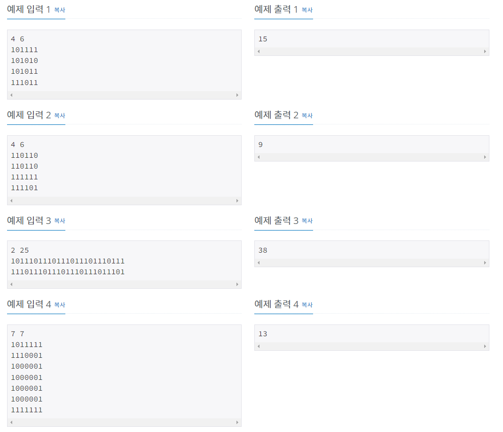

# 백준 2178번 미로탐색




이 문제는 N x M 크기의 배열로 표현되는 미로가 있을 때 (1, 1) 부터 (N, M) 로 가기 위한 최소의 칸 수를 구하는 프로그램을 작성하는 것이다.

즉, 최단경로를 출력하는 알고리즘을 작성하라는 것인데, 그래프에서 최단 경로를 구하기 위한 알고리즘으로 bfs를 사용하여 이 문제를 쉽게 풀 수 있다.

코드는 다음과 같다.

```python
import sys

n, m = map(int, sys.stdin.readline().split())

# 배열 그래프
graph = [[0 for _ in range(m + 1)] for _ in range(n + 1)]

# 방문여부 확인
visited = [[False for i in range(m + 1)] for i in range(n + 1)]

# 거리 칸 수 입력 리스트
dist = [[0 for _ in range(m + 1)] for _ in range(n + 1)]
# 상  하 좌 우 이동 순서 상관 x
dir = [[-1, 0], [0, 1], [1, 0], [0 ,-1]]

for i in range(1, n + 1):
    num = int(sys.stdin.readline())
    j = m
    while j > 0:
        graph[i][j] = num % 10
        num //= 10
        j -= 1

def bfs(graph, a, b):
    que = []
    dist[a][b] = 1
    visited[a][b] = True
    que.append([a, b])
    while(len(que) != 0):
        y = que[0][0]
        x = que[0][1]
        que.pop(0)

        if x == n and y == m:
            return
        
        for i in range(4):
            dx = x + dir[i][1]
            dy = y + dir[i][0]

            if (dx >= 1 and dx <= m and dy >= 1 and dy <= n):
                if visited[dy][dx] == False and graph[dy][dx] == 1:
                    visited[dy][dx] = True
                    que.append([dy, dx])
                    dist[dy][dx] = dist[y][x] + 1
bfs(graph, 1, 1)

print(dist[n][m])
```